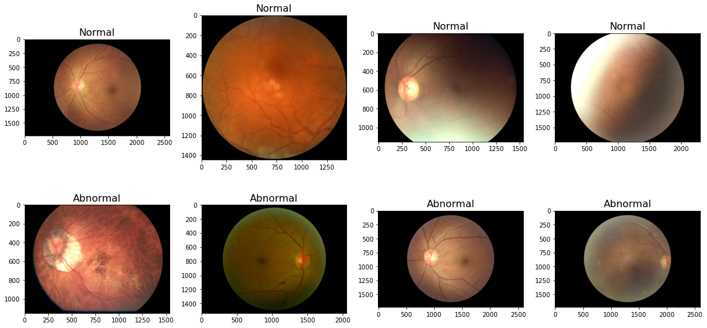
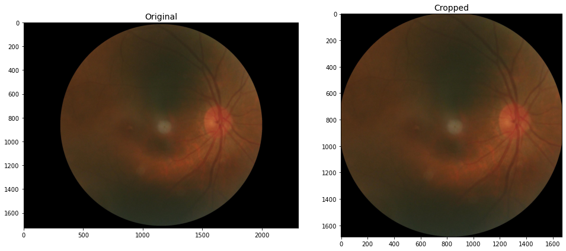
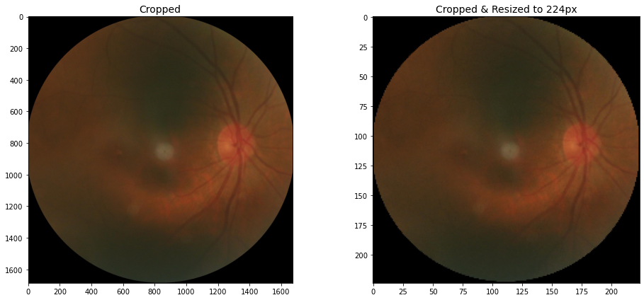

# Detecting optic abnormalities through Fundus photography
*First level screening tool to reduce man-hours spent on grading retinal images* |  
*An image classification model with binary outcomes* 

---

### Repo Contents:

#### Code
**Notebooks:**
 1. [Data Cleaning & Exploratory Data Analysis](./code/01_eda.ipynb)
 2. [Image Preprocessing](./code/02_preprocessing.ipynb)
 3. [Model and Conclusion](./code/03_modelling.ipynb)
 
#### Assets
- [data.csv](./assets/data.csv): Image metadata file
- [256_img_data](https://drive.google.com/file/d/1UeyWb28l9xd6lVrghUsDdPcxZ08qEfNI/view?usp=sharing)

#### Saved model
- [Weights from models](./saved_model/weights)
- [Final model](https://drive.google.com/drive/folders/1g663DMBmBEd-p2sUvDUOgoRLk0m0e31B?usp=sharing)

---

## Executive Summary

### Problem Statement
Accordingly, eye disease in Singapore is becoming extremely prevalent due to certain lifestyle factors and its rapidly ageing population. All eye conditions are projected to increase by 2040. While eye conditions such as myopia and refractive error would remain to be most prevalent in Singapore, other eye disease such as diabetic retinopathy (DR), cataract and glaucoma would see almost and over 100% increase each in the number of cases in the Country. With an inevitable increase in demand, healthcare providers are looking into development and provision of infrastructure and resources to adequately meet the eye care needs of the population. 

The increase in prevalence comes with the need to detect and diagnose eye conditions in order to provide proper treatment and care. A technique used to detects eye conditions is known as Fundus Photography, a process whereby the the back of your eyes (retina) is photographed directly as the pupil is used as both an entrance and exit for the fundus camera's illuminating and imaging light rays. Ophthalmologists use these retinal photographs to follow, diagnose, and treat eye diseases. 

Currently, fundus images are analysed by trained readers, which is described as a tedious, tiring and time-consuming process. The images currently go through up to three levels of checks. Primary graders are the first to take a look at an image and around half of all images at this level typically turn out to have no abnormalities. Images with abnormalities, as well as 10 per cent of the "normal" images, are then sent to a group of secondary graders. If the primary and secondary graders disagree in their analysis of an image, it will be sent to an ophthalmologist. Only about 5 per cent of such images reach this stage. 

As part of preliminary efforts to reduce the intensive manpower required in the process, a Convolutional Neural Network model will be trained to classify if abnormalities are detected in the retinal images (i.e. binary outcome of 0:Normal or 1:Abnormal).

Metrics used to evaluate the model will be based on Accuracy, and Recall for the medical industry since its better to err on the side of caution, rather than missing out on a diagnosis which result in late treatment or other serious consequences.

### Dataset
Ocular Disease Intelligent Recognition (ODIR) is a structured ophthalmic database of 5,000 patients who have taken ocular health examination with age, color fundus photographs from left and right eyes and doctors' diagnostic keywords from doctors.

This dataset is collected by Shanggong Medical Technology Co., Ltd. from different hospitals/medical centers in China. In these institutions, fundus images are captured by various cameras in the market, such as Canon, Zeiss and Kowa, resulting into varied image resolutions. Patient identifying information will be removed. Annotations were labeled by trained human readers with quality control management. They classify patient into eight labels including:

- Normal (N),
- Diabetes (D),
- Glaucoma (G),
- Cataract (C),
- Age related Macular Degeneration (A),
- Hypertension (H),
- Pathological Myopia (M),
- Other diseases/abnormalities (O)

For the scope of this project, the dataset was relabelled to either normal or abnormal instead.
This dataset can be downloaded [here](https://academictorrents.com/details/cf3b8d5ecdd4284eb9b3a80fcfe9b1d621548f72). 

### Data Cleaning & Exploratory Data Analysis

Image metadata and images of 3,500 patients were in the dataset provided. 
The metadata contained 3,500 rows, each row with diagnostic keyword for the left eye and right eye, as well as multiple labels for the set of eyes. It was restructured to show each eye as one line of data, and relabelled to show if it is normal or abnormal. Images which were not annotated due to low image quality were dropped.

At the end of this stage, there are 6,980 images remaining.

### Image Preprocessing

As images were taken on different cameras and collated from various medical institutions, the dimensions and quality of each image is different. The first step taken was to crop based on empty row or column of pixels (black edges). 

Next, the images were resize with padding in order to maintain the aspect ratio. 

### Neural Network Architecture and evaluation

The model utilizes four convolutional layers. Batch Normalisation is applied after every layer, and a Max Pooling layer is applied after with size (2,2).

After pooling, the data is flatten then fed through an output dense layer.

The model was able to achieve an accuracy of 0.64 which is only slightly higher than the baseline accuracy of 0.55, while it is able to score a 0.91 on recall. 

---
## Conclusions and Recommendations
While the goal is to reduce manhours spent on grading retinal images by utilising this classification model as a baseline screening, we are only in the preliminary stages of training the model. The model should definitely be trained to reach at least 90% accuracy prior to deployment. 

### Further steps
More images can be fed for the model to learn more of these features and increase accuracy and the relevant metrics. Image enhancement and segmentation could be explored to singularise certain faint features, and identify each region of interest that could allow the model to learn and predict based on these features.

With a high enough accuracy, recall and AUC score, the model can then be deployed into machines that can  automatically read images once the retinal image is taken, and provide a reading of whether abnormalities are detected. This speeds up the process of grading and in turn, less waiting time, which is also a major pain point for patients in hospitals.

---
## References

https://www.snec.com.sg/patient-care/specialties-and-services/clinics-centres/sidrp 
https://www.annals.edu.sg/pdf/47VolNo1Jan2018/MemberOnly/V47N1p13.pdf  
https://www.opsweb.org/page/fundusphotography
